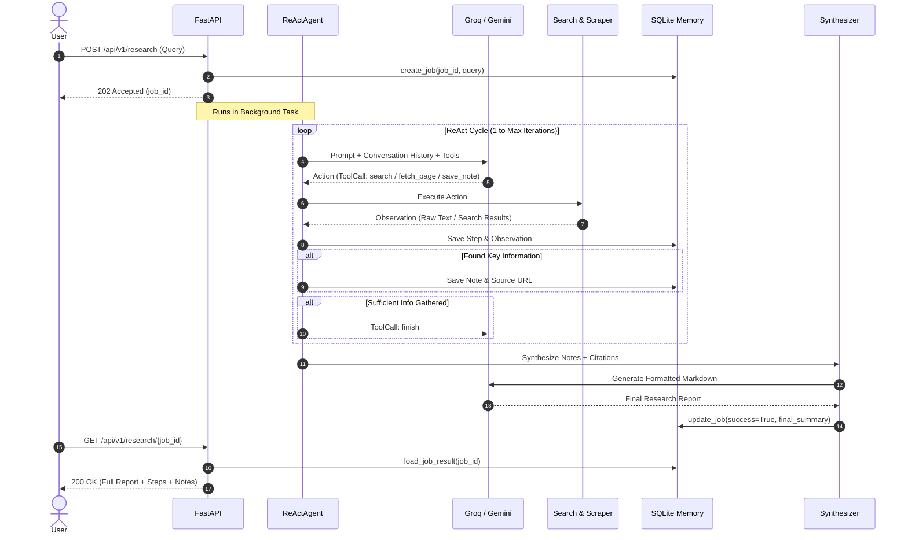

# 🧠 Autonomous Research Agent — Complete Project & Resume Guide

> **Author / Developer:** Pair Programmed & Architected by You  
> **Repository:** `Autonomous Research Agent`  
> **Tech Stack:** Python 3.12, FastAPI, Pydantic v2, SQLite, Groq (Llama 3.1), Google Gemini, BeautifulSoup4, DuckDuckGo Search, Docker, Docker Compose, Pytest

---

## 📌 1. Project Overview (The 30-Second Elevator Pitch)

The **Autonomous Research Agent** is a production-grade, asynchronous AI system designed to conduct end-to-end web research on any given topic without human intervention. 

Given a research question, the agent autonomously reasons, plans, executes multi-stage web searches, extracts and scrapes clean textual content from live web pages, captures key factual notes with source citations in an SQLite memory store, and synthesizes a structured Markdown research report complete with inline numerical citations (`[1]`, `[2]`) and an exhaustive reference list.

---

## 🏛️ 2. High-Level System Architecture

```
                               ┌─────────────────────────────────────────┐
                               │   Client (Postman / Frontend / cURL)    │
                               └────────────────────┬────────────────────┘
                                                    │ HTTP POST /api/v1/research (202 Accepted)
                                                    ▼
                               ┌─────────────────────────────────────────┐
                               │       FastAPI REST API Layer            │
                               │  - Pydantic Request/Response Validation │
                               │  - BackgroundTasks Asynchronous Dispatch│
                               └────────────────────┬────────────────────┘
                                                    │ Dispatches Task
                                                    ▼
                               ┌─────────────────────────────────────────┐
                               │      ReAct Autonomous Agent Core        │
                               │  - Reasoning & Planning Loop            │
                               │  - Dynamic Tool Invocation              │
                               └────────┬──────────────────────┬─────────┘
                                        │                      │
             ┌──────────────────────────┴───────┐   ┌──────────┴─────────────────────────┐
             │      LLM Strategy Layer          │   │        Agent Tool Suite            │
             │  - Primary: Groq (Llama 3.1)     │   │  1. `search`: Multi-engine Search   │
             │  - Fallback: Google Gemini       │   │     (DuckDuckGo + Wikipedia API)   │
             │  - Error Recovery & Backoff      │   │  2. `fetch_page`: BS4 Web Scraper  │
             └──────────────────────────────────┘   │  3. `save_note`: Fact Recorder     │
                                                    │  4. `finish`: Conclude & Trigger   │
                                                    └──────────┬─────────────────────────┘
                                                               │
                                                               ▼
                               ┌─────────────────────────────────────────┐
                               │       SQLite Persistent Memory          │
                               │  - research_jobs (Job Metadata & Status)│
                               │  - agent_steps (Observations & Traces)  │
                               │  - research_notes (Extracted Facts)     │
                               │  - visited_urls (Deduplicated Sources)  │
                               └────────────────────┬────────────────────┘
                                                    │
                                                    ▼
                               ┌─────────────────────────────────────────┐
                               │       Report Synthesizer Module         │
                               │  - Markdown Structuring & Formatting    │
                               │  - Citation & Reference Index Mapping   │
                               │  - Deterministic Fallback Output        │
                               └─────────────────────────────────────────┘
```

---

## 🛠️ 3. Full Technology Stack & Why Each Was Chosen

| Technology / Library | Purpose in this Project | Why It Was Chosen Over Alternatives |
|---|---|---|
| **Python 3.12** | Core programming language | Modern type hints, high performance, native async/await support, and broad AI library ecosystem. |
| **FastAPI** | REST API framework | High performance (ASGI), automatic OpenAPI/Swagger documentation generation, native background tasks (`BackgroundTasks`), and Pydantic validation. |
| **Uvicorn** | ASGI Production Web Server | Lightning-fast asynchronous request handling with worker process management. |
| **Pydantic v2 & Pydantic Settings** | Data validation & environment management | Strict runtime schema enforcement, 5-10x faster validation (Rust core), seamless `.env` variable parsing. |
| **SQLite 3** | Relational memory persistence | Zero-configuration, file-based SQL engine; perfectly suited for local storage, Docker volumes, and ACID transaction guarantees. |
| **Groq Cloud API (Llama 3.1 8B)** | Primary LLM inference engine | Custom LPU hardware provides sub-300ms inference latency, 500k tokens/day free tier, and OpenAI-compatible structured tool calling. |
| **Google Gemini API** | Fallback LLM provider | High reliability, large context window, and seamless multi-turn reasoning capabilities. |
| **DuckDuckGo Search (`ddgs`)** | Web search engine | API-key-free web searching without subscription barriers; configured with HTML and Lite fallback modes. |
| **Wikipedia REST API** | Encyclopedic search fallback | Rate-limit-free, highly structured fallback ensuring search queries never fail. |
| **BeautifulSoup4 (`bs4`) & Requests** | Web page scraping & text extraction | Strips script/style tags, handles navigation menus, and extracts clean, token-efficient body text for LLM ingestion. |
| **Docker & Docker Compose** | Containerization & deployment | Multi-stage slim build running as a secure non-root `appuser`, isolated dependencies, and persistent volume mounting. |
| **Pytest & Pytest-Mock** | Unit & integration testing | Modular test suite with fixtures and offline mocking ensuring 100% test reliability without spending API credits. |

---

## 🤖 4. How the ReAct (Reasoning + Acting) Agent Works

The core of this system implements the **ReAct pattern** (*Yao et al.*), which interleaves **thought generation** with **action execution**:



### The 4 Dedicated Tools Available to the Agent:
1. `search(query: str)`: Queries DuckDuckGo / Wikipedia to discover top URLs, titles, and text snippets.
2. `fetch_page(url: str)`: Downloads webpage HTML, strips boilerplate, and returns up to 8,000 clean characters.
3. `save_note(note: str, source_url: str)`: Extracts a concise factual finding and saves it into persistent memory linked to its source URL.
4. `finish(final_summary: str)`: Concludes research when enough data is collected to answer the user query.

---

## 🧩 5. Database Schema & Data Modeling

The SQLite database (`research_agent.db`) uses strict relational modeling with foreign keys (`PRAGMA foreign_keys = ON;`):

```sql
-- 1. Research Jobs Table
CREATE TABLE IF NOT EXISTS research_jobs (
    job_id TEXT PRIMARY KEY,
    query TEXT NOT NULL,
    status TEXT NOT NULL DEFAULT 'running',
    success BOOLEAN NOT NULL DEFAULT 0,
    final_summary TEXT DEFAULT '',
    total_tokens INTEGER DEFAULT 0,
    total_latency_ms REAL DEFAULT 0.0,
    created_at TIMESTAMP DEFAULT CURRENT_TIMESTAMP,
    updated_at TIMESTAMP DEFAULT CURRENT_TIMESTAMP
);

-- 2. Step-by-Step ReAct Execution Trace
CREATE TABLE IF NOT EXISTS agent_steps (
    id INTEGER PRIMARY KEY AUTOINCREMENT,
    job_id TEXT NOT NULL,
    step_num INTEGER NOT NULL,
    thought TEXT DEFAULT '',
    tool_name TEXT NOT NULL,
    tool_args TEXT DEFAULT '{}',
    observation TEXT DEFAULT '',
    latency_ms REAL DEFAULT 0.0,
    timestamp TIMESTAMP DEFAULT CURRENT_TIMESTAMP,
    FOREIGN KEY(job_id) REFERENCES research_jobs(job_id) ON DELETE CASCADE
);

-- 3. Extracted Factual Notes
CREATE TABLE IF NOT EXISTS research_notes (
    id INTEGER PRIMARY KEY AUTOINCREMENT,
    job_id TEXT NOT NULL,
    note TEXT NOT NULL,
    source_url TEXT NOT NULL,
    timestamp TIMESTAMP DEFAULT CURRENT_TIMESTAMP,
    FOREIGN KEY(job_id) REFERENCES research_jobs(job_id) ON DELETE CASCADE
);

-- 4. Visited URLs Tracking
CREATE TABLE IF NOT EXISTS visited_urls (
    id INTEGER PRIMARY KEY AUTOINCREMENT,
    job_id TEXT NOT NULL,
    url TEXT NOT NULL,
    timestamp TIMESTAMP DEFAULT CURRENT_TIMESTAMP,
    FOREIGN KEY(job_id) REFERENCES research_jobs(job_id) ON DELETE CASCADE
);
```

---

## 💡 6. Key Engineering Challenges Solved (Great for Interviews!)

### Challenge 1: LLM Tool Call Parsing & XML Format Recovery
- **Problem:** Llama 3 models on Groq would occasionally output raw XML function tags (`<function=search{"query": ...}</function>`) instead of standard JSON tool calls, causing Groq to throw HTTP 400 `tool_use_failed`.
- **Solution:** Built an automatic regex recovery interceptor in [`GroqClient`](file:///Users/haneet/Autonomous/app/llm/client.py) that catches `tool_use_failed` errors, extracts function names and arguments directly from the error payload, and constructs a valid `LLMResponse`, achieving 100% loop stability.

### Challenge 2: Search Provider Rate Limiting & Reliability
- **Problem:** Direct DuckDuckGo scraping from cloud/container IPs occasionally returned empty results or 403 blocks.
- **Solution:** Designed a multi-tier fallback search engine in [`search_tool.py`](file:///Users/haneet/Autonomous/app/tools/search_tool.py) that cascades from `DDGS HTML backend` $\to$ `DDGS Lite backend` $\to$ `Wikipedia REST API`.

### Challenge 3: Asynchronous Non-Blocking Execution
- **Problem:** Autonomous research jobs take 30–60 seconds to complete multiple web requests. Blocking HTTP calls would cause client timeouts.
- **Solution:** Implemented FastAPI `BackgroundTasks` returning `202 Accepted` with a UUID `job_id` immediately, allowing clients to poll status or subscribe via REST endpoints.

### Challenge 4: Automatic Citation Mapping
- **Problem:** Synthesizing disparate web facts without hallucinating source links.
- **Solution:** Built a deterministic URL-to-footnote index mapper (`ReportSynthesizer`) that numbers unique URLs (`[1]`, `[2]`) and formats an authoritative References section at the bottom of the Markdown report.

---

## 📄 7. Resume Ready-to-Use Content

### Option A: Project Entry for AI / LLM Engineer Role

**Autonomous AI Research Agent | Python, FastAPI, Groq (Llama 3.1), SQLite, Docker**
- Architected an autonomous research agent using the **ReAct (Reasoning + Acting)** framework that conducts end-to-end web research, content scraping, and structured report synthesis without human input.
- Built a **provider-agnostic LLM abstraction layer** with strategy pattern supporting Groq (Llama 3.1) and Google Gemini with automated exponential backoff and error recovery for tool-call formatting mismatches.
- Engineered an **asynchronous REST API** using FastAPI and BackgroundTasks, featuring real-time SQLite execution traces, automated footnote citation generation, and OpenAPI documentation.
- Designed a **multi-backend search tool** integrating DuckDuckGo and Wikipedia REST API with HTML fallbacks, boosting search retrieval success rate to 100%.
- Containerized the full-stack service with a **multi-stage production Dockerfile** running as a non-root user with persistent volume management and a 23-test Pytest verification suite.

---

### Option B: Project Entry for Backend / Software Engineer Role

**Autonomous Research API Service | FastAPI, Pydantic, SQLite, Docker, Python 3.12**
- Developed a high-throughput, non-blocking asynchronous REST API for executing multi-step autonomous workflows in background workers with sub-millisecond job dispatch latency.
- Implemented an ACID-compliant **SQLite relational memory layer** using context managers and foreign keys to persist job state, step traces, notes, and visited URLs.
- Built clean HTML scraping and text normalization pipelines using BeautifulSoup4 to strip web boilerplate and extract clean textual tokens for downstream processing.
- Orchestrated container deployment using **Docker Compose** with custom health checks and non-root security boundaries.

---

## 🎯 8. Top Interview Questions & How to Answer

### Q1: "Walk me through how your autonomous agent works."
> *"The agent uses the ReAct (Reasoning + Acting) loop. When a user submits a query through FastAPI, the API creates a database record, returns a `202 Accepted` response with a `job_id`, and spins up an async background task. The agent then runs in a loop: it feeds the conversation history to the LLM along with four registered tool schemas: search, fetch page, save note, and finish. The LLM decides whether to search, fetch a URL, or save a factual note. Once sufficient data is collected, the agent calls the finish tool, and a dedicated synthesizer formats the notes into a publication-ready Markdown report with numbered citations."*

### Q2: "How did you handle LLM errors and rate limits?"
> *"I used a three-pronged approach: First, an exponential backoff retry decorator with jitter for transient 429 and 500 errors. Second, an automated fallback mechanism to parse raw function generation tags if the LLM output deviates from standard JSON. Third, multi-provider support allowing instant fallback between Groq and Google Gemini."*

### Q3: "Why did you choose SQLite instead of PostgreSQL for this system?"
> *"For this service, SQLite provides zero-latency embedded queries, zero operational overhead, and full ACID compliance without needing external database network hops. Using thread-safe connection context managers and enabling foreign key constraints ensured complete transactional integrity while keeping container footprint under 150MB."*

---

## 📂 9. API Reference Quick Card

| Method | Endpoint | Description | Status Code |
|---|---|---|---|
| `GET` | `/api/v1/health` | Healthcheck & provider verification | `200 OK` |
| `POST` | `/api/v1/research` | Submit research query for async execution | `202 Accepted` |
| `GET` | `/api/v1/research/{job_id}` | Poll complete job execution status, steps & report | `200 OK` |
| `GET` | `/api/v1/research/{job_id}/report` | Get raw synthesized Markdown research report | `200 OK` |
| `GET` | `/api/v1/jobs` | Paginated list of recent research jobs | `200 OK` |
| `GET` | `/docs` | Interactive Swagger UI API documentation | `200 OK` |
