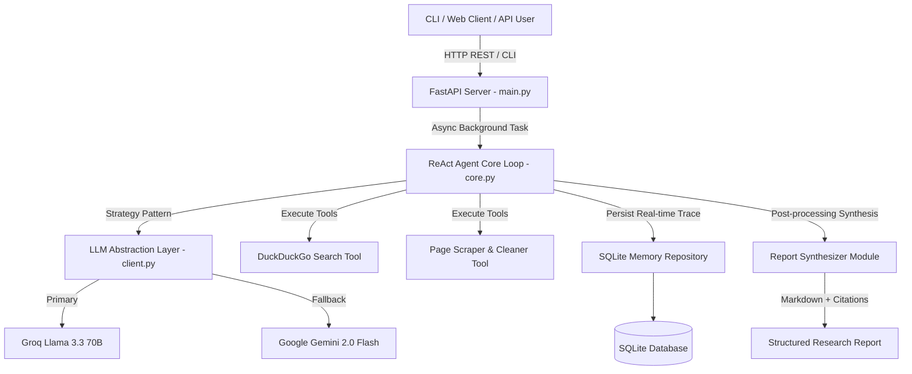

# Autonomous Research Agent

Production-quality, clean-architecture Autonomous Research Agent built in Python.

The agent accepts a research query, autonomously plans its steps, executes DuckDuckGo web searches, scrapes and cleans web page content, records factual notes with source URLs in an SQLite memory repository, and synthesizes a publication-ready Markdown research report complete with inline citations (`[1]`, `[2]`) and a master references section.

---

## 🏛️ Architecture Overview



---

## ✨ Key Features & Architectural Principles

- **Clean Architecture & SOLID Principles**: Strictly decoupled layers for tools, LLM providers, database memory, ReAct execution, report synthesis, and API routing.
- **Provider-Agnostic LLM Layer (Strategy Pattern)**:
  - **Primary**: Groq (`llama-3.3-70b-versatile`).
  - **Fallback**: Gemini Flash (`gemini-2.0-flash`).
  - **Exponential Backoff & Jitter**: Resilient retry decorator handles transient 429 rate limits and 5xx API errors.
- **SQLite Persistent Memory Layer**:
  - Relational schema storing `research_jobs`, `agent_steps`, `research_notes`, and `visited_urls`.
  - Transactional connection context manager enforcing `PRAGMA foreign_keys = ON;`.
  - CRUD repository isolating SQL from the agent and API layers.
- **Report Synthesizer**:
  - Transforms raw notes into structured Markdown (`# Research Report`, `## Executive Summary`, `## Key Findings`, `## Detailed Analysis`, `## Sources & References`).
  - Deduplicates source URLs and attaches bracketed numerical citations (`[1]`, `[2]`).
  - Deterministic error fallback generator guarantees output even if LLM calls fail.
- **Non-Blocking FastAPI REST API**:
  - `POST /api/v1/research` submits jobs to async background workers and returns `202 Accepted` immediately.
  - Interactive Swagger UI documentation at `http://localhost:8000/docs`.
- **100% Pytest Test Suite**:
  - 23 unit and integration tests covering all modules with fast offline mocking.
- **Docker Containerization**:
  - Multi-stage slim build (`Dockerfile`) running as a non-root system user (`appuser`).
  - Docker Compose orchestration with persistent SQLite volume storage.

---

## 📁 Directory Structure

```text
research-agent/
├── app/
│   ├── config.py              # Environment settings & logging initialization
│   ├── main.py                # FastAPI application, CORS, lifespan hooks
│   ├── api/                   # REST API routes, schemas, and background worker
│   │   ├── schemas.py         # Request/Response Pydantic models
│   │   ├── services.py        # Async background worker executor
│   │   └── routes.py          # REST endpoints (/health, /research, /jobs)
│   ├── agent/                 # ReAct core loop, prompts, schemas, synthesizer
│   │   ├── schemas.py         # Note, AgentStep, AgentRunResult Pydantic models
│   │   ├── prompts.py         # REACT_SYSTEM_PROMPT & SYNTHESIS_SYSTEM_PROMPT
│   │   ├── core.py            # ReActAgent execution loop
│   │   └── synthesizer.py     # ReportSynthesizer class
│   ├── memory/                # SQLite connection manager & repository
│   │   ├── database.py        # Schema creation & connection context manager
│   │   └── repository.py      # CRUD data access functions
│   ├── llm/                   # Strategy pattern client & retry logic
│   │   ├── client.py          # BaseLLM, GroqClient, GeminiClient, LLMFactory
│   │   ├── schemas.py         # Message, Role, ToolCall, LLMResponse models
│   │   └── exceptions.py      # Exception hierarchy
│   └── tools/                 # Web tools layer
│       ├── search_tool.py     # DuckDuckGo search integration
│       └── fetch_page_tool.py # Web scraper & Markdown cleaner
├── tests/                     # Standardized Pytest test suite (23 passing tests)
│   ├── conftest.py            # Shared fixtures (tmp_db, mock_llm, api_client)
│   ├── test_config.py         # Config unit tests
│   ├── test_tools.py          # Search & fetch tool unit tests
│   ├── test_llm.py            # LLM abstraction unit tests
│   ├── test_memory.py         # SQLite memory layer unit tests
│   ├── test_synthesizer.py    # Report synthesizer unit tests
│   ├── test_agent.py          # ReAct agent unit & integration tests
│   └── test_api.py            # FastAPI REST endpoints integration tests
├── scripts/                   # CLI verification scripts
│   └── run_agent.py           # Command-line agent runner
├── Dockerfile                 # Multi-stage production Dockerfile
├── docker-compose.yml         # Container orchestration configuration
├── run_server.py              # Uvicorn CLI server entrypoint
└── requirements.txt           # Python dependencies
```

---

## 🚀 Quickstart Guide

### 1. Installation

```bash
# Clone repository and enter project root
cd research-agent

# Create virtual environment
python3 -m venv venv
source venv/bin/activate

# Install dependencies
pip install -r requirements.txt
```

### 2. Environment Setup

Create a `.env` file in the project root:

```env
GROQ_API_KEY=your_groq_api_key_here
GEMINI_API_KEY=your_gemini_api_key_here
LLM_PROVIDER=groq
LOG_LEVEL=INFO
MAX_ITERATIONS=10
REQUEST_TIMEOUT=15
DATABASE_PATH=research_agent.db
PORT=8000
HOST=0.0.0.0
```

---

## 💻 Usage

### Option A: Command Line Interface (CLI)

Run the autonomous research agent directly from your terminal:

```bash
python3 scripts/run_agent.py --query "Latest advancements in quantum computing"
```

Options:
- `--query`: Research topic or question.
- `--provider`: Override LLM provider (`groq` or `gemini`).
- `--max-iterations`: Limit maximum ReAct steps (default: 10).
- `--job-id`: Specify a custom unique job identifier.

---

### Option B: FastAPI REST Server

Launch the REST API server:

```bash
python3 run_server.py --port 8000 --reload
```

The interactive Swagger UI documentation will be available at:
`http://localhost:8000/docs`

---

## 📡 REST API Endpoint Reference

| Method | Endpoint | Description | Payload / Query |
| :--- | :--- | :--- | :--- |
| `GET` | `/health` | Health monitoring & DB ping | None |
| `POST` | `/api/v1/research` | Submit research query (Async) | `{"query": "Topic", "provider": "groq"}` |
| `GET` | `/api/v1/research/{job_id}` | Poll status, steps, notes, metrics | None |
| `GET` | `/api/v1/research/{job_id}/report` | Export raw Markdown report | None |
| `GET` | `/api/v1/jobs` | List recent research jobs | `?limit=20&offset=0` |

### Curl Examples

#### Submit a Research Query (`POST`):
```bash
curl -X POST "http://localhost:8000/api/v1/research" \
     -H "Content-Type: application/json" \
     -d '{"query": "Impact of Artificial Intelligence on Medical Diagnostics", "max_iterations": 5}'
```

**Response (`202 Accepted`):**
```json
{
  "job_id": "c6990b83-24c8-4a3e-a329-73549d2c0db4",
  "query": "Impact of Artificial Intelligence on Medical Diagnostics",
  "status": "running",
  "message": "Research job submitted successfully and executing in the background.",
  "created_at": "2026-08-09T19:20:00.000000"
}
```

#### Poll Job Status & Results (`GET`):
```bash
curl "http://localhost:8000/api/v1/research/c6990b83-24c8-4a3e-a329-73549d2c0db4"
```

#### Download Raw Synthesized Markdown Report (`GET`):
```bash
curl "http://localhost:8000/api/v1/research/c6990b83-24c8-4a3e-a329-73549d2c0db4/report"
```

---

## 🧪 Running Automated Tests

Run the full Pytest test suite:

```bash
pytest tests/
```

Run tests with verbose logging:

```bash
pytest tests/ -vv
```

---

## 🐳 Docker Deployment

### Using Docker Compose (Recommended)

Build and launch the containerized stack with volume persistence:

```bash
docker-compose up -d --build
```

Check container status and health:

```bash
docker-compose ps
```

View container logs:

```bash
docker-compose logs -f
```

Stop container:

```bash
docker-compose down
```

---

## 🛡️ License

Built under the MIT License.
